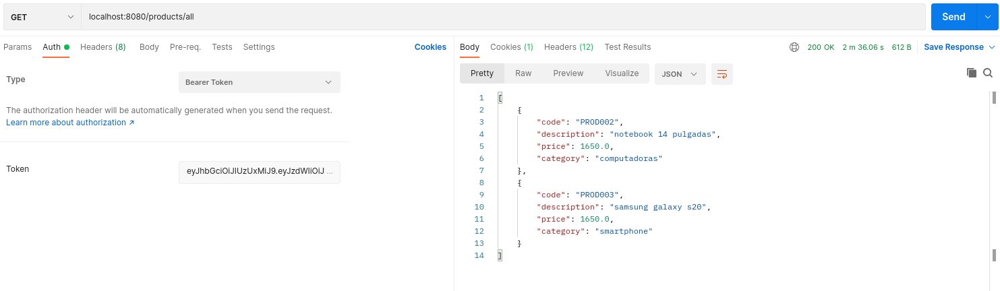
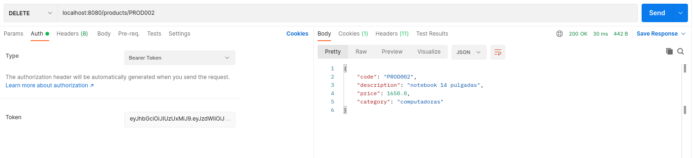

# Proyecto ecommerce para el curso de back-end de coderhouse

### Debajo se muestran todas las respuestas de POSTMAN:

## Usuarios:
### Registrando un nuevo usuario:

### Login del usuario:

## Productos:
### Agregando un producto:

### Leyendo un producto:

### Actualizando un producto:

### Leyendo todos los productos:

### Borrando un producto:

## Carrito:
### Crear carrito:

### Agregar al carrito:

### Borrar producto del carrito:

## Orden
### Crear orden:

